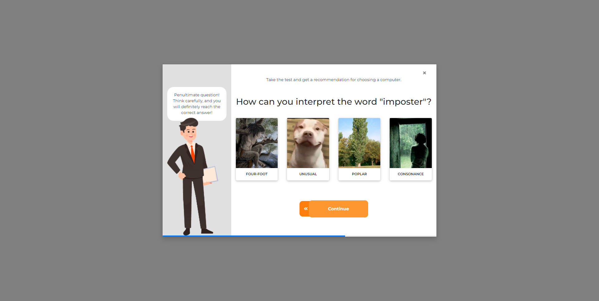

## Quiz Vue

### About

This project implements a quiz using Vue.js and Bootstrap 5.

### Requirements & usage

Project requires: -

Tested on:
* Windows 10

Usage:
* Just open index.html in any internet browser like Google Chrome.

### Folders structure

    .
    ├── css             # CSS Styles
    ├── img             # images
    │   ├── character   # for character
    │   └── quiz        # for answer options
    ├── js              # quiz settings and methods
    ├── index.html
    ├── LICENSE
    └── README.md

